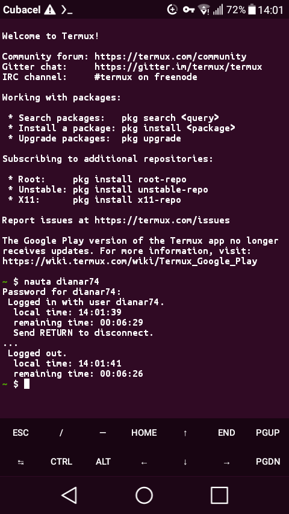

# nauta-py
Simple routine helping use of cuban Nauta Wi-Fi service.

## How to use?
In order to get online you just need to execute the routine like: 
- `python3 nauta.py username@nauta.com.cu password`
or
- `python3 nauta.py username password`

It might be that you're in a crowded place, in that case, call the routine like: 
- `python3 nauta.py username@nauta.com.cu`
or
- `python3 nauta.py username`

## Installation
Install using pipx:
- `pip3 install pipx`
- `pipx install .`

## Screenshots

